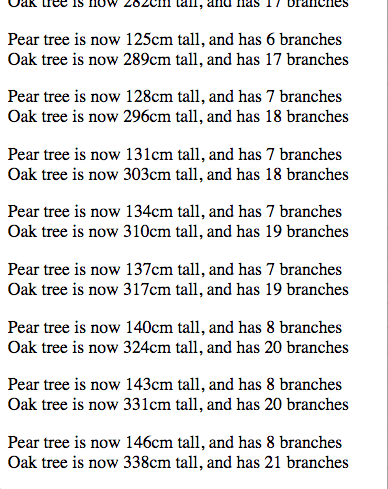

# Pear and Oak Tree Orchard Simulator

## Instructions

<!-- Use Jasmine to write your unit tests before you begin writing **any** implementation code.

### Unit Tests

1. There should be a `Plant` function defined.
1. There should be a `Tree` function defined.
1. There should be a function named `increaseHeight` on the prototype of Plant.
1. There should be a function named `decreaseHeight` on the prototype of Plant.
1. There should be a `height` property on Plant.
1. There should be a function named `grow` on the prototype of Tree.
1. There should be a function named `trim` on the prototype of Tree.
1. When you invoke the `trim` method on Tree, the height of the Tree should be reduced by the integer value that is passed as an argument (e.g. `PearTree.trim(2)`)
1. When you invoke the `trim` method on Tree, the values of the `branches` property should be decreased by one.
1. When you invoke the `grow` method on Tree, the height of the Tree should be increased by the integer value that is passed as an argument (e.g. `PearTree.grow(2)`)
 -->
### Requirements & Behavior

> Reference: Checkout the [setInterval](https://developer.mozilla.org/en-US/docs/Web/API/WindowTimers/setInterval) and [clearInterval](https://developer.mozilla.org/en-US/docs/Web/API/WindowTimers/clearInterval) functions in JavaScript

1. Create a Plant function.
1. Create a Tree function.
1. Plant should be the prototype of Tree.
1. Plant should have a property of `height`.
1. The Plant prototype should have two methods on it: `increaseHeight` and `decreaseHeight`. Each method should accept an integer value as input.
    ```js
    Plant.prototype.increaseHeight = function (growth) {

    }
    ```
1. `increaseHeight` should increase the value of the `height` property by the amount passed in as an argument.
1. `decreaseHeight` should decrease the value of the `height` property by the amount passed in as an argument.
1. Tree should have a property of `branches`.
1. The Tree prototype should have two methods on it: `grow` and `trim`.
1. The `grow` method should accept an integer value as input.
    ```js
    Tree.prototype.grow = function (amount) {

    }
    ```
1. The `grow` method should increase the height of the tree.
1. The `trim` method should accept an integer value as input.
1. The `trim` method should decrease the height of the tree.
1. When the `trim` method is called, the number of branches should decrease by one.
1. Each time the height of a tree increases by 10, the value of `branch` should increase by one.
1. Create a PearTree instance of Tree. `var PearTree = new Tree();`
1. Create an OakTree instance of Tree.
1. Every second, increase the height the pear tree by some integer value and increase the height the oak tree by some integer value that is **larger** than what you used for the pear tree.
1. Also output the current height of each tree and how many branches it has to the DOM.

    > Pear tree is now 23cm tall and has 2 branches
    > 
    > Oak tree is now 57cm tall and has 4 branches

1. Every tenth time the trees are grown, invoke the `trim` method. Pass one value to the method for the pear tree, and a larger value to the method on the oak tree.
1. Stop growing the trees after they have grown 30 times.

